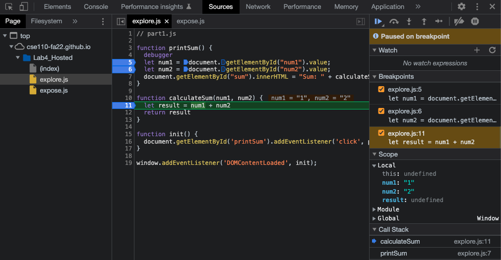
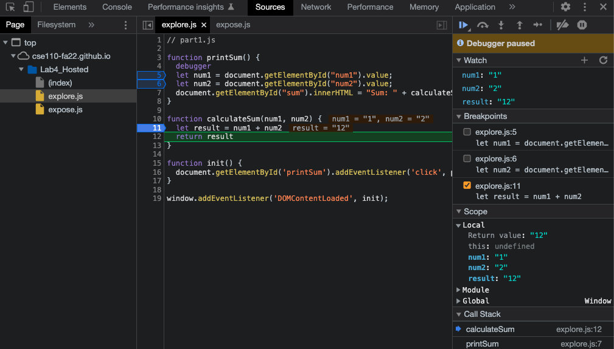
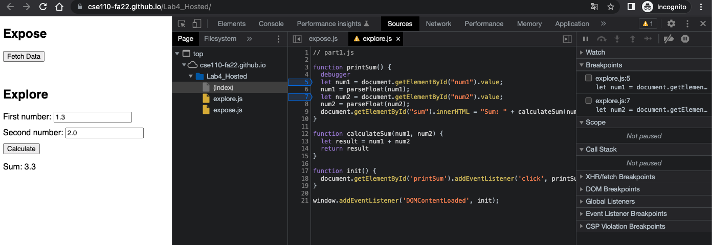

Breakpoints

Data type

1. The input `num1` and `num2` are strings. So the operator `+` concatenates them together, which is not the sum we wanted.
2. Fix: convert the input strings into floats before adding them together.
